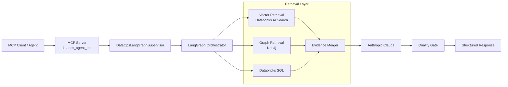
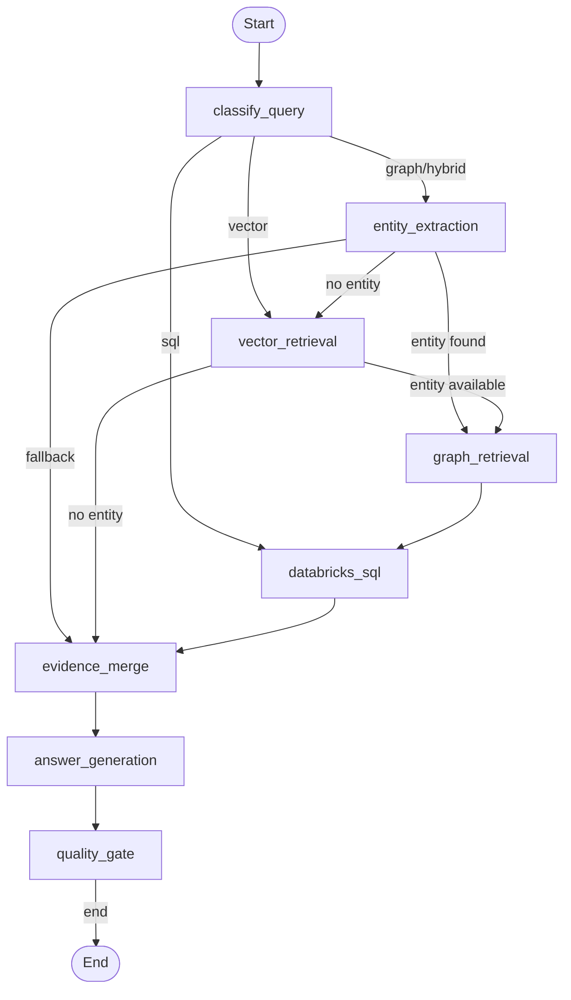
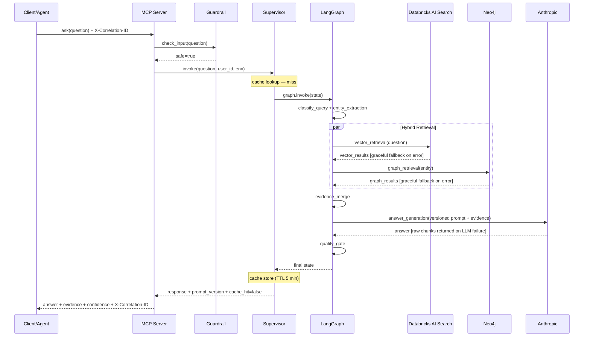

# System Architecture

This document describes the architecture of the Real-Time HybridRAG Minimum Viable Product (MVP) and how data flows across retrieval, orchestration, and serving layers.

## Goals

- Provide grounded answers using both semantic vector retrieval and lineage-aware graph retrieval.
- Support near real-time context updates from event streams.
- Expose a single tool interface for agent workflows.
- Keep deployment production-friendly on AWS EKS.

## High-Level Architecture

```text
MCP Client / Agent
  -> MCP Server (dataops_agent_tool)
  -> DataOpsLangGraphSupervisor
  -> LangGraph Nodes
      -> Query classification and routing
      -> Entity extraction
      -> Vector retrieval (Databricks AI Search)
      -> Graph retrieval (Neo4j)
      -> Evidence merge
      -> Answer generation (Anthropic)
      -> Quality gate
  -> Structured response
```

## Architecture Diagram



## Orchestration Diagram



## Sequence Diagram: Single Query Path



## Runtime Components

- MCP server facade: src/dataops_graphrag_mcp/mcp_server/server.py
- MCP tool wrapper: src/dataops_graphrag_mcp/mcp_server/tools_langgraph.py
- Supervisor entrypoint: src/dataops_graphrag_mcp/langgraph_orchestrator/supervisor.py
- LangGraph build and routing:
  - src/dataops_graphrag_mcp/langgraph_orchestrator/graph.py
  - src/dataops_graphrag_mcp/langgraph_orchestrator/nodes.py
  - src/dataops_graphrag_mcp/langgraph_orchestrator/edges.py
- Retrieval adapters:
  - src/dataops_graphrag_mcp/vectorrag/
  - src/dataops_graphrag_mcp/graphrag/
- Security and resilience:
  - src/dataops_graphrag_mcp/llm/guardrails.py
  - src/dataops_graphrag_mcp/llm/prompts.py (versioned at `PROMPT_VERSION`)
- API and CLI entrypoints:
  - src/dataops_graphrag_mcp/app/api.py (rate limiting, correlation ID middleware)
  - src/dataops_graphrag_mcp/app/cli.py

## Tech Stack Alignment

This architecture implements the stack listed in [README Tech Stack](../README.md#tech-stack):

- Orchestration: LangGraph + MCP + FastAPI
- Retrieval: Databricks AI Search + Neo4j
- Streaming enrichment: Kafka + Flink SQL + Kafka Connect
- Generation and monitoring: Anthropic + LangSmith
- Deployment platform: Docker + Kubernetes on AWS EKS

## Request Lifecycle

1. Request arrives at API (`/ask`), CLI, or MCP tool.
2. API middleware assigns a `X-Correlation-ID` and enforces the per-IP rate limit.
3. Input guardrail (`llm/guardrails.py`) screens the question; blocked requests return HTTP 400.
4. Supervisor checks the TTL response cache — a hit returns immediately with `"cache_hit": true`.
5. Supervisor builds the initial graph state with user, environment, and LangSmith metadata.
6. Query router classifies the question and selects the retrieval mode.
7. LangGraph executes retrieval nodes with graceful degradation:
   - Vector retrieval from Databricks AI Search (falls back to empty results with a warning on failure).
   - Graph retrieval from Neo4j when an entity is identified (falls back to vector-only on failure).
8. Evidence merger combines vector chunks and graph relationships.
9. Answer generation calls Anthropic Claude using the versioned prompt (`PROMPT_VERSION`); on LLM failure, returns raw retrieved chunks as fallback.
10. Quality gate marks evidence grounding.
11. Response is cached and returned with `prompt_version`, `cache_hit`, and `missing_evidence_warnings`.

## Data Plane: Streaming Updates

```text
Source events
  -> Kafka raw topic
  -> Flink SQL enrichment
      -> generate_embedding UDF calls Databricks model serving endpoint
      -> produces embedding ARRAY<FLOAT> alongside chunk_text
  -> Kafka enriched vector topic (chunk_text + embedding) + enriched graph topic
  -> Kafka Connect sinks
      -> Databricks Delta/AI Search source table
      -> Neo4j graph nodes and edges
```

Reference artifacts:

- Flink SQL job: resources/jobs/flink_realtime_hybrid_updates.sql
- Embedding UDF Maven project: flink-embedding-udf/ (produces flink-embedding-udf.jar)
- Connector templates:
  - resources/connectors/templates/vector_sink_databricks_jdbc.tmpl.json
  - resources/connectors/templates/graph_sink_neo4j.tmpl.json
- Producer: src/dataops_graphrag_mcp/ingestion/realtime_event_producer.py

## Deployment Topology

- Containerized Python service deployed on AWS EKS.
- Kubernetes assets under deploy/k8s/.
- IAM permissions delegated via IRSA service account.
- Runtime configuration from ConfigMap and secret-backed environment variables.
- Internal ingress expected from platform-specific manifests.

See docs/deployment.md for deployment sequence.

## Monitoring and Evaluation

- LangSmith tracing configured in `DataOpsLangGraphSupervisor.__init__` via `configure_langsmith()`.
- Each `invoke` call is decorated with `@traceable`; tagged with `app_env`, `request_env`, and `prompt_version`.
- Structured JSON logging with per-request correlation ID via `common/logging.py`.
- Trace settings: `LANGSMITH_TRACING`, `LANGSMITH_API_KEY`, `LANGSMITH_PROJECT`, `LANGSMITH_ENDPOINT`, `LANGSMITH_TAGS`.
- Evaluation helpers at src/dataops_graphrag_mcp/evaluation/langsmith_eval.py:
  - `keyword_score` — fraction of expected keywords found in the answer.
  - `retrieval_recall` — fraction of expected source IDs in top-k results.
  - `factuality_score` — keyword-overlap proxy for answer grounding in evidence.
  - `composite_score` — weighted aggregate (keyword 40%, recall 30%, factuality 30%).

## Security and Operations Notes

- Input guardrail (`llm/guardrails.py`) screens every question before the pipeline runs; hard-blocks prompt injection patterns without an LLM call.
- API rate limiter: 60 requests per 60 s per IP in `app/api.py`; replace with Redis-backed middleware for multi-replica deployments.
- Every API response carries an `X-Correlation-ID` header traceable through JSON logs.
- All prompts are versioned (`PROMPT_VERSION` in `llm/prompts.py`); bump on any template change.
- Store secrets outside source control and inject at runtime.
- Restrict egress to Databricks, model provider, and graph backend endpoints.
- Use workload-level health checks and rolling updates.

## Related Docs

- README.md
- docs/runbook.md
- docs/deployment.md
- docs/cost_model.md
- resources/connectors/README.md
