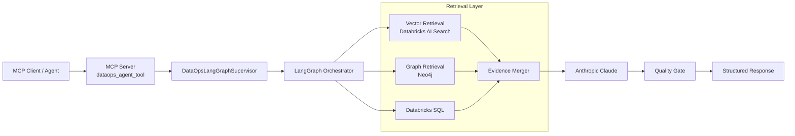
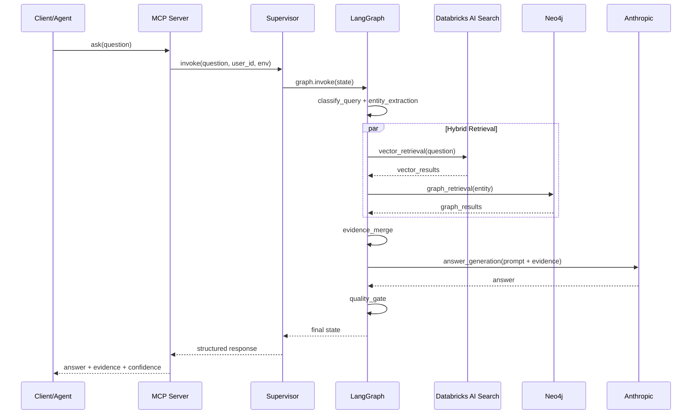

# System Architecture

This document describes the architecture of the Real-Time HybridRAG Minimum Viable Product (MVP) and how data flows across retrieval, orchestration, and serving layers.

## Goals

- Provide grounded answers using both semantic vector retrieval and lineage-aware graph retrieval.
- Support near real-time context updates from event streams.
- Expose a single tool interface for agent workflows.
- Keep deployment production-friendly on AWS EKS.

## High-Level Architecture

```text
MCP Client / Agent
  -> MCP Server (dataops_agent_tool)
  -> DataOpsLangGraphSupervisor
  -> LangGraph Nodes
      -> Query classification and routing
      -> Entity extraction
      -> Vector retrieval (Databricks AI Search)
      -> Graph retrieval (Neo4j)
      -> Evidence merge
      -> Answer generation (Anthropic)
      -> Quality gate
  -> Structured response
```

## Architecture Diagram



## Orchestration Diagram


## Sequence Diagram: Single Query Path



## Runtime Components

- MCP server facade: src/dataops_graphrag_mcp/mcp_server/server.py
- MCP tool wrapper: src/dataops_graphrag_mcp/mcp_server/tools_langgraph.py
- Supervisor entrypoint: src/dataops_graphrag_mcp/langgraph_orchestrator/supervisor.py
- LangGraph build and routing:
  - src/dataops_graphrag_mcp/langgraph_orchestrator/graph.py
  - src/dataops_graphrag_mcp/langgraph_orchestrator/nodes.py
  - src/dataops_graphrag_mcp/langgraph_orchestrator/edges.py
- Retrieval adapters:
  - src/dataops_graphrag_mcp/vectorrag/
  - src/dataops_graphrag_mcp/graphrag/
- API and CLI entrypoints:
  - src/dataops_graphrag_mcp/app/api.py
  - src/dataops_graphrag_mcp/app/cli.py

## Tech Stack Alignment

This architecture implements the stack listed in [README Tech Stack](../README.md#tech-stack):

- Orchestration: LangGraph + MCP + FastAPI
- Retrieval: Databricks AI Search + Neo4j
- Streaming enrichment: Kafka + Flink SQL + Kafka Connect
- Generation and monitoring: Anthropic + LangSmith
- Deployment platform: Docker + Kubernetes on AWS EKS

## Request Lifecycle

1. A question arrives from MCP, API, or CLI.
2. Supervisor builds the initial graph state with user and environment metadata.
3. Query router selects the retrieval mode.
4. Graph executes retrieval nodes:
   - Vector retrieval from Databricks AI Search index.
   - Graph retrieval from Neo4j lineage graph when an entity is identified.
5. Evidence merger combines vector chunks and graph relationships.
6. Answer generation produces the final response.
7. Quality gate marks whether evidence grounding is present.
8. Response is returned as a normalized contract.

## Data Plane: Streaming Updates

```text
Source events
  -> Kafka raw topic
  -> Flink SQL enrichment
      -> generate_embedding UDF calls Databricks model serving endpoint
      -> produces embedding ARRAY<FLOAT> alongside chunk_text
  -> Kafka enriched vector topic (chunk_text + embedding) + enriched graph topic
  -> Kafka Connect sinks
      -> Databricks Delta/AI Search source table
      -> Neo4j graph nodes and edges
```

Reference artifacts:

- Flink SQL job: resources/jobs/flink_realtime_hybrid_updates.sql
- Embedding UDF Maven project: flink-embedding-udf/ (produces flink-embedding-udf.jar)
- Connector templates:
  - resources/connectors/templates/vector_sink_databricks_jdbc.tmpl.json
  - resources/connectors/templates/graph_sink_neo4j.tmpl.json
- Producer: src/dataops_graphrag_mcp/ingestion/realtime_event_producer.py

## Deployment Topology

- Containerized Python service deployed on AWS EKS.
- Kubernetes assets under deploy/k8s/.
- IAM permissions delegated via IRSA service account.
- Runtime configuration from ConfigMap and secret-backed environment variables.
- Internal ingress expected from platform-specific manifests.

See docs/deployment.md for deployment sequence.

## Monitoring and Evaluation

- LangSmith tracing is configured at startup in `DataOpsLangGraphSupervisor.__init__` via `configure_langsmith()`.
- Each `invoke` call is decorated with `@traceable` and tagged with `app_env` and `request_env`.
- Trace settings are controlled by:
  - LANGSMITH_TRACING
  - LANGSMITH_API_KEY
  - LANGSMITH_PROJECT
  - LANGSMITH_ENDPOINT
  - LANGSMITH_TAGS
- Evaluation helpers are available at src/dataops_graphrag_mcp/evaluation/langsmith_eval.py.

## Security and Operations Notes

- Store secrets outside source control and inject at runtime.
- Restrict egress to Databricks, model provider, and graph backend endpoints.
- Use workload-level health checks and rolling updates.
- Monitor retrieval quality and answer confidence over time.

## Related Docs

- README.md
- docs/runbook.md
- docs/deployment.md
- docs/cost_model.md
- resources/connectors/README.md
