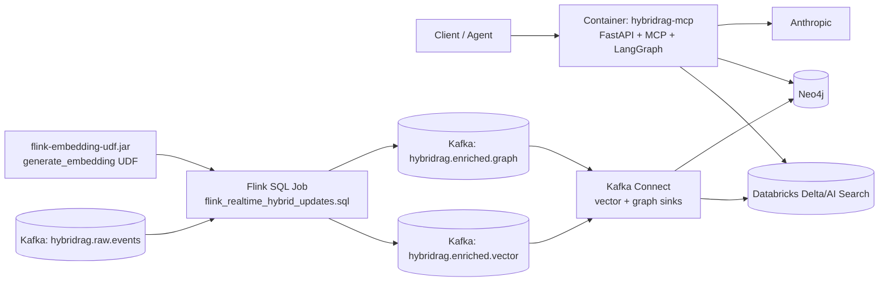
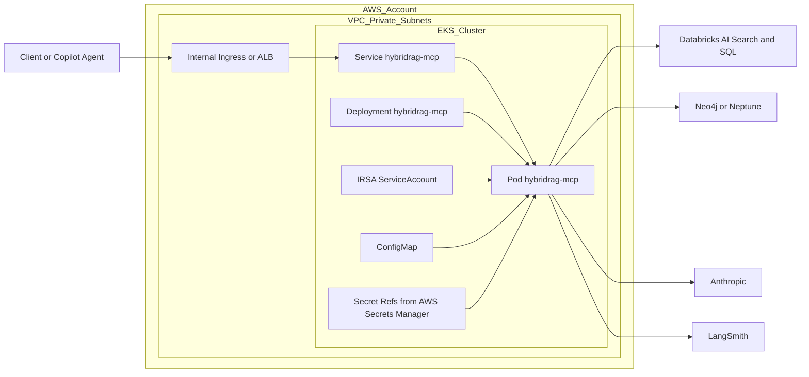

# Deployment: AWS EKS + Databricks + Neo4j/Neptune

```text
Client / Copilot / Agent -> private ingress -> EKS service hybridrag-mcp -> LangGraph -> Databricks AI Search + SQL -> Neo4j/Neptune -> Anthropic Claude
```

Use private subnets, IRSA-backed service account, Secrets Manager for secrets, internal service exposure, and separate bootstrap jobs for AI Search indexing and graph population.

## Component Diagram: Decontainer



## Component Diagram: EKS



## Related Docs

- [Architecture](architecture.md)
- [README](../README.md)
- [Runbook](runbook.md)
- [Cost Model](cost_model.md)

## Platform Stack

This deployment guide operationalizes the stack in [README Tech Stack](../README.md#tech-stack):

1. Runtime: Python service container + Java-based Flink UDF JAR.
2. Platform: Docker + Kubernetes on AWS EKS with IRSA.
3. Data and retrieval dependencies: Databricks AI Search/SQL and Neo4j/Neptune.
4. Observability: LangSmith tracing plus centralized logs/metrics.

## Introduction: Running Production Deployment on AWS EKS

This guide provides the minimum sequence to deploy and run the HybridRAG MCP service on AWS EKS in a production-style setup.

The deployment flow is:

1. Build and publish the container image.
2. Create networking, IAM, and Kubernetes primitives.
3. Configure runtime secrets and environment values.
4. Deploy the MCP service and verify readiness.
5. Execute bootstrap jobs for vector and graph data.

Expected outcome:

1. A private, authenticated MCP service running in EKS.
2. Successful connectivity from the service to Databricks and Neo4j/Neptune.
3. Working retrieval and response generation for HybridRAG queries.

## Prerequisites

1. AWS account with EKS cluster access and kubectl context configured.
2. Container registry access (Amazon ECR recommended).
3. Databricks workspace configured with AI Search + SQL endpoint access.
4. Neo4j or Amazon Neptune endpoint reachable from EKS VPC.
5. Anthropic API key and required service credentials in AWS Secrets Manager.
6. Local tools installed: aws CLI, kubectl, docker, and python/uv.

## Quick Start (Production-Oriented)

Run from repository root in this order.

### 1) Build and push the image

```bash
docker build -f deploy/docker/Dockerfile -t hybridrag-mcp:prod .
# tag and push to your ECR repository
```

### 2) Create namespace and identity resources

```bash
kubectl apply -f deploy/k8s/namespace.yaml
kubectl apply -f deploy/k8s/serviceaccount-irsa.yaml
```

### 3) Apply service config and workload

Update image tag, environment values, and secret references in the manifests before applying.

```bash
kubectl apply -f deploy/k8s/configmap.yaml
kubectl apply -f deploy/k8s/deployment.yaml
kubectl apply -f deploy/k8s/service.yaml
```

Ingress is environment-specific and is intentionally not versioned in this repository. Apply your internal ingress manifest separately in your platform repo.

### 4) Verify deployment health

```bash
kubectl -n hybridrag get pods
kubectl -n hybridrag get svc
kubectl -n hybridrag logs deploy/hybridrag-mcp --tail=200
```

### 5) Run bootstrap jobs (one-time or scheduled)

Use Databricks jobs in resources/jobs to initialize retrieval stores:

1. resources/jobs/ingest_documents.yml
2. resources/jobs/build_vector_index.yml
3. resources/jobs/build_graph.yml

Then deploy the MCP LangGraph job definition:

1. resources/jobs/deploy_mcp_langgraph.yml

For continuous Confluent Kafka/Flink driven updates into vector and graph stores, deploy this stream stack:

1. Build and deploy the Flink embedding UDF JAR:
   ```bash
   cd flink-embedding-udf && mvn clean package
   # copy target/flink-embedding-udf.jar to the Flink cluster classpath
   ```
2. Producer service using src/dataops_graphrag_mcp/ingestion/realtime_event_producer.py
3. Flink SQL transform using resources/jobs/flink_realtime_hybrid_updates.sql
4. Kafka Connect sinks:
   - resources/connectors/templates/vector_sink_databricks_jdbc.tmpl.json
   - resources/connectors/templates/graph_sink_neo4j.tmpl.json

## Monitoring and Tracing

1. Enable LangSmith tracing for the supervisor invocation path.
2. Export logs and metrics to your central observability stack.
3. Alert on error rate, latency, and dependency availability thresholds.

## Post-Deployment Validation

1. Call the API health endpoint and MCP endpoint through internal ingress.
2. Run a known HybridRAG validation question and validate:
   - Vector retrieval returns relevant chunks.
   - Graph retrieval returns expected entities/edges.
   - Final answer includes grounded evidence.
3. Confirm logs and metrics are exported to your observability stack.

## Operational Notes

1. Use rolling updates with readiness/liveness probes for zero-downtime upgrades.
2. Store all secrets in Secrets Manager and rotate on a defined schedule.
3. Restrict egress and security groups to only required Databricks/Neo4j/Neptune endpoints.
4. Keep vector and graph bootstrap pipelines decoupled from request-serving workloads.
